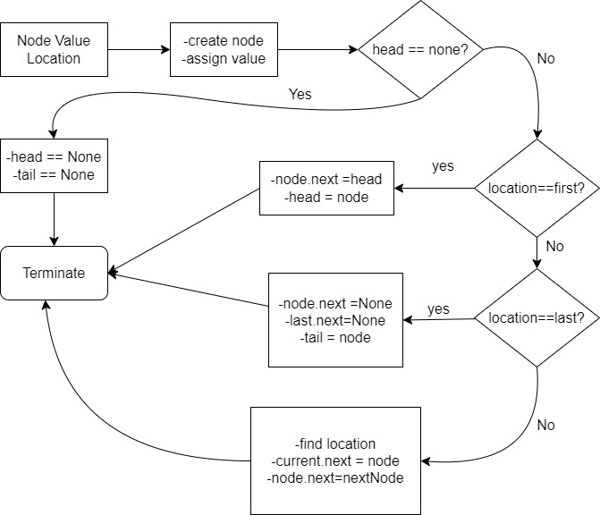

# Linked List
> It is a form of sequential collection and it does not have to be in order. A linked list is made up of independant nodes that contain any type of data and each node is a reference to next node in the link.
-----------------------
## How is linked list different from an array ?
1. elements of linked lists are independant objects
2. linked lists have no predefined size 
3. insertion and removal of elements in linked lists is efficient 
-------------------------
## types of linked lists 
- singly linked list
- circularly singly linked list 
- doubly linked list 
- circular doubly linked list
-------------------------
## Creation of singly linked list 
Step 1. Create a head and tail , initialize with none
Step 2. Create a blank node and assign a value to it and reference (next) to none
Step 3. link head and tail with their node values
** refer creation.py for more clarity **

## Insertion in a linked list 
> insertion in a linked list happens in three ways , either to the head , or the tail or in between somewhere , here is an algorithm flowchart to get some idea about it.
